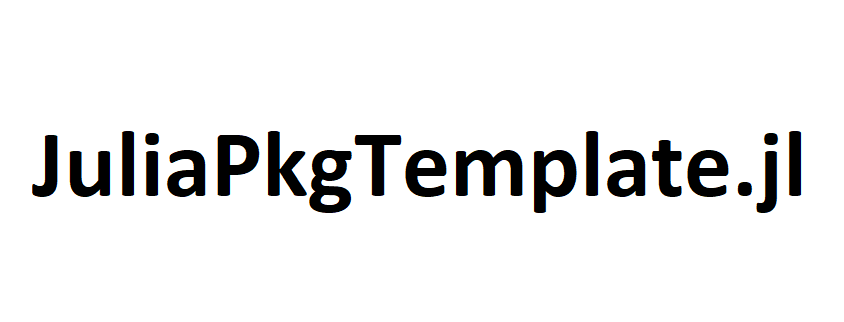

```@meta
CurrentModule = JuliaPkgTemplate
DocTestSetup = quote
    using JuliaPkgTemplate
end
```


# JuliaPkgTemplate.jl

This can be used as a template for any new package for Julia. It supports
docs, CI, tagging releases, and formatting.

## Creating a new Julia package

1. Clone the repository

2. Create a new UUID and update Project.toml with package name and dependencies.

	using UUIDs
	uuid4()

3. Update README.md and docs. In particular, update reference in docs/make.jl.

4. Create src/<PackageName>.jl and include dependencies and other source files.

5. Export appropriate functions.

